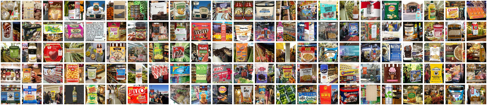

# IMGrocery-100K.github.io
Towards a large-scale dataset of branded food product images

IMGrocery-100K is an ongoing project to create a large scale grocery food products dataset with the intention to advance the research on vision and language reasoning models. The IMGrocery-100K contains 106 thousand different product entries with rich metadata (a natural language description, an ingredients list, and a nutritional facts table), and an overall count of over one million images (10 per product) that have been crawled from a web search engine using their respective Universal Product Code (UPC) as query.

We are currently working on cleaning the noise in the crawled images collection as well as at defining a set of tasks that can be performed in this dataset, for example: image multi-label classification, multimodal search and retrieval, nutritional facts prediction, or dietary related visual question answering.

A particularly interesting aspect of this dataset is that the interplay between vision and language is twofold: on one side from the products metadata knowledge base, in which information is stored in natural language, and on the other hand from the textual information displayed on the products packaging/labeling, which provides high level semantic information about the product.

Contact us if you want to get access to the dataset and/or if you want to collaborate in the IMGrocery-100K creation process.

Diego E. Apéstegui, Lluís Gómez, Dimosthenis Karatzas. Computer Vision Centre, Universitat Autònoma de Barcelona.
